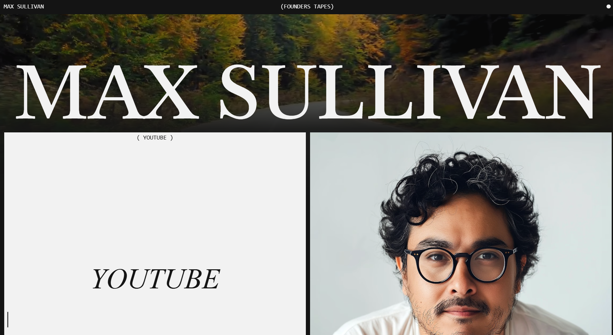

# Astra — Minimalist Agency/Portfolio Template




## Overview

Astra is a curated digital experience crafted for agencies and freelancers. It prioritizes clean typography, ample whitespace, and sophisticated motion design to showcase creative work with impact.

**Tech Stack:** Next.js (App Router) • React • Tailwind CSS • Framer Motion • GSAP • Lenis (Smooth Scroll)

⚠️ **IMPORTANT NOTICE:** This project is **NOT** a template for sale. It is completely free and open-source. Please ensure you provide proper credit to the original creators and developers when using or sharing this codebase.


## Getting Started

1. Clone the repository
```bash
git clone https://github.com/Ethan4582/Astra
```

2. Install dependencies
```bash
npm install
```

3. Run the development server
```bash
npm run dev
```

4. Open [http://localhost:3000](http://localhost:3000) in your browser.

## Credits

**Inspired by:** [Slate Department](https://slate-department.webflow.io/)

This project is a custom Next.js implementation developed to provide a high-performance, open-source version of the Astra landing page design.

## Developer

**Developed by:** [@Ethan4582](https://github.com/Ethan4582)  
**Contact:** [@SinghAshir65848](https://x.com/SinghAshir65848)

## ☕ Support the Creator

If you find this project useful, consider supporting the development!  
Your contribution helps in maintaining and sharing high-quality open-source projects.

[](https://buymeacoffee.com/ashirwad05) [Buy Me a Coffee](https://buymeacoffee.com/ashirwad05)

## License

This project is open-source. Please credit the developers and the original designer when using this work.